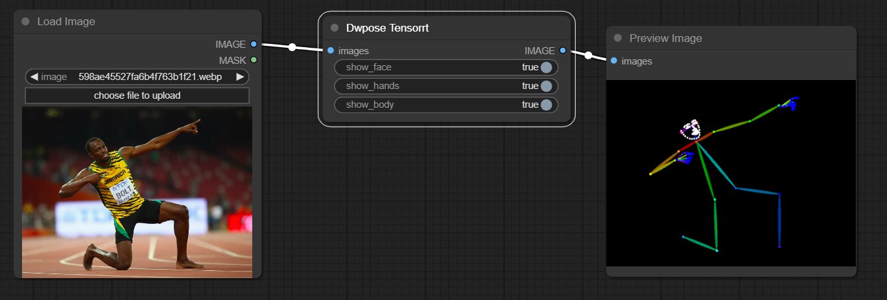

<div align="center">

# ComfyUI Dwpose TensorRT

[](https://www.python.org/downloads/release/python-31012/)
[](https://developer.nvidia.com/cuda-downloads)
[](https://developer.nvidia.com/tensorrt)
[](https://creativecommons.org/licenses/by-nc-sa/4.0/deed.en)

</div>

<p align="center">
  

</p>

This project provides a Tensorrt implementation of Dwpose for ultra fast pose estimation inside ComfyUI

This project is licensed under [CC BY-NC-SA](https://creativecommons.org/licenses/by-nc-sa/4.0/), everyone is FREE to access, use, modify and redistribute with the same license.

For commercial purposes, please contact me directly at yuvraj108c@gmail.com

If you like the project, please give me a star! ⭐

---

## ⏱️ Performance

_Note: The following results were benchmarked on FP16 engines inside ComfyUI, using 1000 similar frames_

| Device | FPS |
| :----: | :-: |
|  L40s  | 20  |

## 🚀 Installation

Navigate to the ComfyUI `/custom_nodes` directory

```bash
git clone https://github.com/yuvraj108c/ComfyUI-Dwpose-Tensorrt
cd ./ComfyUI-Dwpose-Tensorrt
pip install -r requirements.txt
```

## 🛠️ Building Tensorrt Engine

1. Download the following onnx models:
   - [dw-ll_ucoco_384.onnx](https://huggingface.co/yzd-v/DWPose/resolve/main/dw-ll_ucoco_384.onnx)
   - [yolox_l.onnx](https://huggingface.co/yzd-v/DWPose/resolve/main/yolox_l.onnx)
2. Build tensorrt engines for both of these models by running:

   - `python export_trt.py`

3. Place the exported engines inside ComfyUI `/models/tensorrt/dwpose` directory

## ☀️ Usage

- Insert node by `Right Click -> tensorrt -> Dwpose Tensorrt`

## 🤖 Environment tested

- Ubuntu 22.04 LTS, Cuda 12.4, Tensorrt 10.2.0.post1, Python 3.10, L40s GPU
- Windows (Not tested, but should work)

## 👏 Credits

- https://github.com/IDEA-Research/DWPose
- https://github.com/legraphista/dwpose-video

## License

[Creative Commons Attribution-NonCommercial-ShareAlike 4.0 International (CC BY-NC-SA 4.0)](https://creativecommons.org/licenses/by-nc-sa/4.0/)
